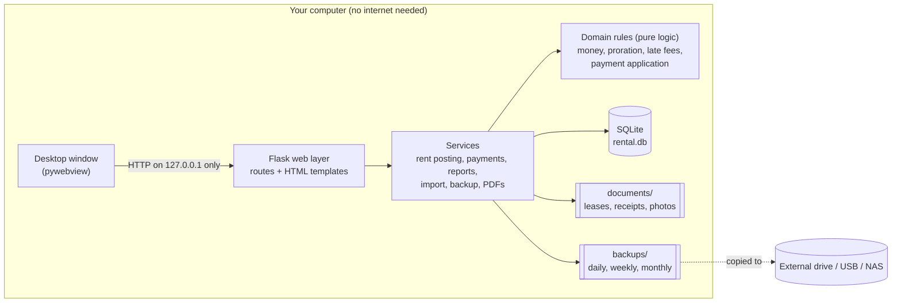
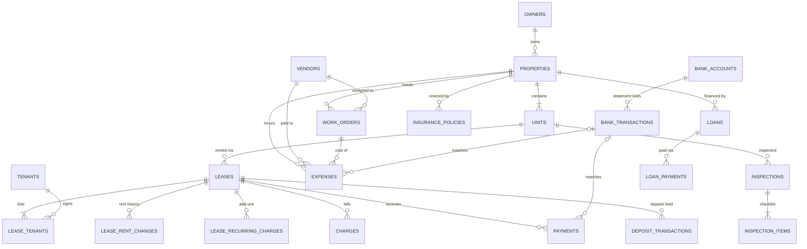
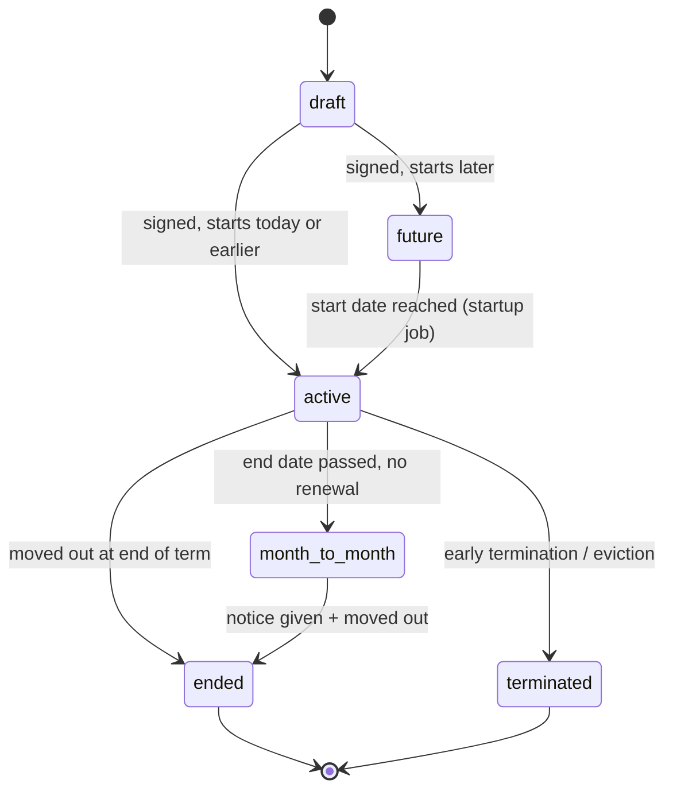

# Rental Tracker: Blueprint for an Offline Rental Management App

This plan is for a desktop app that runs entirely on your own computer. It needs no internet, no subscription and no cloud account. It is sized for **50 to 500+ properties** and one person or a small office.

The database design lives in [`0001_initial.sql`](../src/rental_tracker/db/migrations/0001_initial.sql). It is the app's first migration, so the app and this document share one schema.

**Status:** a simplified version of this design is built: properties, tenants, automatic rent, payments, balances and late tracking, with every field optional. See [§18](#18-build-status) for exactly what the app includes, and the [README](../README.md) to run it. The rest of this document is the full design, kept for reference.

---

## Contents

1. [Goals and non-goals](#1-goals-and-non-goals)
2. [Key decisions at a glance](#2-key-decisions-at-a-glance)
3. [Architecture](#3-architecture)
4. [Technology stack](#4-technology-stack)
5. [Where data lives on disk](#5-where-data-lives-on-disk)
6. [Data model](#6-data-model)
7. [Business rules (the money logic)](#7-business-rules-the-money-logic)
8. [Feature set](#8-feature-set)
9. [Screens and workflows](#9-screens-and-workflows)
10. [Reports](#10-reports)
11. [Running offline: startup, backups, updates, security](#11-running-offline-startup-backups-updates-security)
12. [Onboarding 50+ properties (bulk import)](#12-onboarding-50-properties-bulk-import)
13. [Code structure](#13-code-structure)
14. [Testing strategy](#14-testing-strategy)
15. [Build roadmap](#15-build-roadmap)
16. [Future ideas](#16-future-ideas)
17. [Decisions for you to make before building](#17-decisions-for-you-to-make-before-building)
18. [Build status](#18-build-status)

---

## 1. Goals and non-goals

**Goals**

- **Works 100% offline.** No CDN scripts, web fonts, telemetry or license checks. It still works if the internet is disconnected forever.
- **One source of truth** for properties, units, tenants, leases, rent, deposits, expenses, maintenance and documents.
- **Scales to a real portfolio.** 50+ properties and hundreds of units, with batch entry so the first of the month takes minutes, not hours.
- **Correct money.** Every balance can be traced to individual charges and payments. Every change and delete is recorded in a full audit trail.
- **Your data stays yours.** It lives in a single file you can back up, copy and export to CSV or Excel at any time.
- **Tax-ready.** Expenses map to tax lines (US Schedule E by default, configurable elsewhere).

**Non-goals (deliberately out of scope)**

- Online rent collection, a tenant portal or listing syndication. These need the internet, which conflicts with the offline design.
- Cloud sync between devices. Use backups instead; see §11.
- A full double-entry general ledger. The app keeps a strict tenant ledger and an expense register, and exports clean data for your accountant or QuickBooks. §16 describes how to upgrade later if you need a general ledger.
- Automated tenant screening. You can store screening reports as documents, but the app does not integrate with screening services.

---

## 2. Key decisions at a glance

| Decision | Choice | Why |
|---|---|---|
| App type | Local web app shown in a desktop window | Rich UI with simple tech; no separate server to install |
| Language | Python 3.11+ | Readable, huge library ecosystem, easy for one person to maintain |
| Database | SQLite (single file, WAL mode) | Zero setup, very reliable, handles millions of rows |
| UI | Server-rendered HTML + HTMX | Fast and simple; no JavaScript build pipeline |
| Money | Integer cents | No floating-point rounding errors |
| Balances | Always computed from the ledger | They can never drift out of sync |
| Deletes | Everything can be deleted; money entries can also be voided | Deletes are confirmed, audited, and blocked in locked periods; big deletes take a backup first |
| Scheduled jobs | "Catch-up" when the app opens | No always-on server needed offline |
| Backups | Automatic, rotating, plus an external drive | Protects against a laptop being lost or failing |

---

## 3. Architecture



The app is split into three layers:

1. **Web layer.** A Flask app renders HTML pages. HTMX swaps in partial page updates, such as marking a payment received without reloading the page. The app listens only on `127.0.0.1`, so other computers cannot reach it.
2. **Services.** Each service handles one workflow, such as "post this month's rent" or "record a payment". Services run database transactions and call the domain rules.
3. **Domain rules.** Pure functions with no database or file access: proration, late-fee calculation, payment application and aging. Because they are pure, they are the easiest part to test thoroughly, and they are where bugs would cost the most money.

A small desktop wrapper (**pywebview**) opens the app in a native window, so it looks and feels like a normal program rather than a browser tab.

---

## 4. Technology stack

| Area | Pick | Notes |
|---|---|---|
| Runtime | Python 3.11+ | |
| Web framework | Flask 3 + Jinja2 | Server-rendered pages. Form validation and CSRF protection are small in-house helpers, so Flask is the only required dependency |
| Interactivity | HTMX (vendored file) | Inline edits, batch-entry grids and live filters without a single-page-app framework |
| Styling | Hand-written CSS (local file) | Includes light and dark mode and print styles |
| Charts | Server-rendered CSS bars | Dashboard progress bars need no chart library; Chart.js (vendored) can be added for trend charts later |
| Database | SQLite 3 via Python's built-in `sqlite3` | WAL mode, foreign keys on, FTS5 for search. Plain SQL keeps the schema and the code in one language |
| Migrations | Numbered SQL files + `PRAGMA user_version` | Every schema change is versioned, runs in one transaction, and a backup is taken before migrating |
| PDFs | Printable pages + the browser's "Save as PDF" | Receipts and statements print cleanly with any characters in names. fpdf2 is planned for one-click batch letters |
| Excel/CSV | `csv` module | Import and export CSV, which Excel opens directly. `.xlsx` export (openpyxl) is planned |
| Bank import | `ofxparse` + CSV | Most banks let you download OFX/QFX or CSV files |
| Passwords | argon2-cffi | Only if the password lock or multi-user mode is turned on |
| Desktop window | pywebview | Uses the operating system's built-in web view (Edge WebView2 on Windows, WebKit on macOS) |
| Packaging | PyInstaller (+ Inno Setup on Windows) | One installer; users do not need to install Python |
| Tests | pytest, Hypothesis, Playwright (optional) | See §14 |
| Code quality | ruff (lint and format), mypy (optional) | |

**Offline rule:** every JavaScript, CSS and font file sits in `static/vendor/`. A test fails the build if any template references `http://` or `https://`.

> **Alternative.** If you want a more native-feeling app and are comfortable with JavaScript, **Tauri + SvelteKit + SQLite** is the best alternative. The data model and business rules in this document apply unchanged.

---

## 5. Where data lives on disk

On first launch, the app asks you to choose a data folder. The default is `Documents/RentalTracker`:

```
RentalTracker/
├── rental.db              ← the whole database (plus rental.db-wal / -shm while running)
├── documents/             ← attached files, stored by content hash: ab/ab34f9….pdf
├── backups/
│   ├── daily/             ← 14 kept
│   ├── weekly/            ← 8 kept
│   └── monthly/           ← 24 kept
├── exports/               ← PDFs, CSV and Excel files the app generates
├── imports/               ← CSV/OFX files you drop in; archived after import
├── templates/             ← your editable letter templates
├── logs/                  ← app.log, rotated
└── app.lock               ← stops two copies of the app writing at once
```

- **Documents are content-addressed.** A file's name is its SHA-256 hash, so the same file is never stored twice, files never change after they are saved, and backups only need to copy new files.
- To move to a new computer, install the app, copy this folder over, and point the app at it.

---

## 6. Data model

The full DDL, with every column, constraint and index, is in [`0001_initial.sql`](../src/rental_tracker/db/migrations/0001_initial.sql). This section explains the structure.

### 6.1 Core relationships



### 6.2 Table groups

| Group | Tables | Purpose |
|---|---|---|
| Portfolio | `owners`, `properties`, `units`, `tags`, `property_tags` | Who owns what. Every property has at least one unit (a house has one unit, `Main`). Tags group large portfolios, e.g. "North side" or "Section 8". |
| Tenancy | `tenants`, `leases`, `lease_tenants`, `lease_rent_changes`, `lease_recurring_charges` | People, contracts, co-tenants and guarantors, rent increases with effective dates, and add-ons such as pet rent and parking |
| Tenant ledger | `charges`, `payments`, `deposit_transactions` | What each lease owes, what was paid, and deposit money held |
| Spending | `vendors`, `expense_categories`, `expenses`, `recurring_expenses` | Bills, receipts, tax-line mapping, and recurring costs such as insurance, HOA dues and taxes |
| Operations | `work_orders`, `inspections`, `inspection_items`, `reminders`, `communications` | Maintenance, move-in and move-out condition records, to-dos, and the tenant contact log |
| Files | `documents`, `letter_templates` | Attachments on any record, and mail-merge templates |
| Finance | `bank_accounts`, `bank_transactions`, `loans`, `loan_payments`, `insurance_policies`, `mileage_trips` | Reconciliation, mortgage interest and principal, policy renewals, and deductible mileage |
| System | `users`, `audit_log`, `settings`, `search_index` (FTS5) | Optional login, change history, preferences and global search |

### 6.3 Built-in views

| View | What it gives you |
|---|---|
| `v_rent_roll` | One row per rentable unit: tenants, current rent, market rent, deposit held, balance, occupied or vacant |
| `v_property_occupancy` | Units, occupied units, occupancy %, scheduled rent and vacancy loss per property |
| `v_lease_balances` | Total charged, total paid and balance per lease |
| `v_lease_current_rent` | Today's rent, taking rent changes into account |
| `v_deposit_held` | Deposit money currently held per lease |

### 6.4 Lease lifecycle



A renewal is a **new lease row** with `renewal_of_lease_id` pointing to the old lease. When the new lease starts, the old lease becomes `ended`. This keeps each term's rent, deposit and documents separate. A database index guarantees that a unit can only have **one** `active` or `month_to_month` lease at a time.

---

## 7. Business rules (the money logic)

These rules are the most important part of the app. They belong in `domain/` as pure functions with extensive tests.

### 7.1 Money

- Store all amounts as **integer cents**. Do arithmetic with `int` or `Decimal`, never `float`.
- Rounding happens **once**, at the point a charge is created: round half up to the nearest cent.
- Store percentages as **basis points**: 5% is `500`.

### 7.2 The ledger and balances

```
balance(lease) = Σ charges (not voided) − Σ payments (not voided)
```

- **Charges** are amounts owed: rent, late fees, pet rent, utilities, damage, NSF fees and opening balances. **Credits and concessions** are charges with a negative amount.
- **Payments** are money received. A payment's `method` records how it arrived, including `housing_assistance` for voucher programs and `deposit_applied` when the deposit covers unpaid rent.
- Balances are **never stored**. They are always computed, so they can never be wrong because of a missed update.
- A negative balance is a **tenant credit**, for example after an overpayment.

### 7.3 Automatic rent posting (idempotent)

Offline, no server is running at midnight on the 1st. Instead, rent posting runs as a **catch-up job every time the app opens**, and when you click "Post rent now".

```
for each lease with status active or month_to_month:
    for each month M from the lease start (or the last posted month) through
            this month + (rent_post_days_before_due setting):
        if M is after the lease end and status is not month_to_month: stop
        amount = rent in effect for M          # uses lease_rent_changes
        if M is a partial first or last month and prorate_partial_months:
            amount = prorate(amount, occupied days in M)
        INSERT OR IGNORE charge(lease, 'rent', period=M, source='auto',
                                due_date = M-<rent_due_day>)
    same for each lease_recurring_charges row (pet rent, parking, ...)
```

The unique index `ux_charges_auto_period` on `(lease, type, period, recurring charge)` means the job can run 100 times and still bill each month exactly once. A voided auto charge keeps its slot, so voiding rent as a concession does not cause it to be re-posted.

**Proration** has two methods, chosen in Settings:

- `actual_days` (default): `rent × days_occupied / days_in_month`
- `thirty_day_month`: `rent × days_occupied / 30`

### 7.4 Late fees

For each rent period P whose `due_date + grace_days` has passed, if P has no late fee yet:

1. Work out how much of P's rent was still unpaid at the end of the grace period, by applying payments received up to that date (§7.5).
2. If the unpaid amount is above zero (or above an optional minimum), calculate the fee:
   - `flat`: `late_fee_flat_cents`
   - `percent`: `late_fee_percent_bp` of P's rent
   - In both cases the fee is capped at `late_fee_max_cents`.
3. Depending on the `late_fee_mode` setting:
   - `review` (default): the fee is added to the **Late Fee Review** queue. You approve or waive fees in bulk.
   - `auto`: the fee is posted immediately.

Posted late fees use `source='auto'` and `period=P`, so each period gets at most one fee.

> ⚖️ Late-fee caps, grace periods, and whether daily fees are allowed vary by state and country. The per-lease settings exist so you can match your lease and local law.

### 7.5 Payment application and aging

Payments are **not** stored against specific charges. Instead, the app works out which charges each payment covered on demand, using the `payment_application_order` setting. The default is **oldest charge first, and rent before fees within the same due date**. Some jurisdictions require rent to be paid off before fees, and this order is also the tenant-friendly one.

The same calculation produces:

- **Aging buckets** (0–30, 31–60, 61–90 and 90+ days past due) for the delinquency report
- **"Paid through" date** shown on the tenant page
- The unpaid amount used by the late-fee check

Because this allocation is computed rather than stored, correcting an old payment updates everything consistently. Late fees that were already posted stay as they are.

### 7.6 Voids, deletes, bounced checks and locked periods

- **Void or delete.** Charges, credits, payments, expenses and deposit entries can be **voided**, which keeps a crossed-out line with a required reason, or **deleted**, which removes them. Either way, a full copy of the entry goes into the audit log.
- **Deleting an automatic charge** (rent or an add-on) bills it again with the lease's current terms. This is a quick way to fix a month after correcting the rent. To cancel a month for good, void it instead. A deleted late fee reappears in the review queue.
- **Deleting a record with history** (owner, property, unit, lease, tenant, vendor, category) opens a page listing exactly what goes with it: for example units, leases, payments and expenses. Deletes that remove money entries need the word DELETE typed to confirm. A safety backup is taken just before, and the page suggests safer alternatives where they exist (mark a property Sold, set a unit Offline, untick a vendor's Active box).
- **Rules that keep the books consistent:**
  - A tenant who is the only person on a lease can't be deleted until the lease is.
  - Deleting a category moves its expenses to a category you choose.
  - Deleting a vendor keeps their expenses.
  - Deleting a unit keeps its expenses on the property.
  - Document files stay in the documents folder, so restoring a backup still works.
- **Bounced check (NSF):** void the payment with the reason "NSF", and optionally post an `nsf_fee` charge. This takes one click in the UI.
- **Books lock:** Settings → `books_locked_through` (for example, after filing taxes). Entries dated on or before that date become read-only: they can't be changed, voided or deleted, and neither can records that contain them. To correct them, post an adjustment in the current period.
- Every create, update, void, delete, import, backup and restore is written to the `audit_log` as a JSON diff. For deletes, it holds a copy of the removed row.

### 7.7 Security deposits

- A deposit is a **liability** (money you hold for the tenant), not income. It is excluded from the P&L until it is kept.
- Deposit money held = received + interest − deductions − refunds − amounts applied to the balance.
- **Move-out workflow:** record the move-out inspection, then itemize deductions (each can be linked to photos and invoices). Any unpaid balance can be covered with `applied_to_balance`, which creates a matching `deposit_applied` payment. The remainder is refunded, and the app generates the **deposit disposition letter**.
- The app raises a **deadline reminder** for returning the deposit. The number of days is configurable, because it is set by law (often 14–30 days).

### 7.8 Mortgages

- `loan_payments` is the single source of truth for mortgage interest. The P&L takes interest from it; principal is not an expense, and escrow is split into taxes and insurance.
- The app can generate an amortization schedule from the loan terms, pre-fill each month's payment, and let you correct it from your lender statement.

### 7.9 Portfolio overhead

An expense with no property (for example accounting software or an umbrella policy) is **overhead**. Reports can show it as a separate line, or share it out across properties by unit count or by rent. You choose which in the report.

---

## 8. Feature set

✅ = MVP (phases 1–3) · ➕ = added features (phases 4–6)

### Portfolio
- ✅ Owners and entities (LLCs, trusts), properties, units, property tags and groups
- ✅ Property detail page: units, current tenants, balance, year-to-date income and expenses, open work orders, documents
- ✅ Filter and sort everything by tag, city, owner, occupancy or balance, which matters at 50+ properties
- ➕ Property value tracking, equity (value − loan balances), cap rate and cash-on-cash return
- ➕ Sold or archived properties keep their full history but are hidden from day-to-day lists

### Tenants and leases
- ✅ Tenant profiles, co-tenants, occupants, guarantors and emergency contacts
- ✅ Lease lifecycle (draft → future → active → month-to-month → ended), with renewals linked to the previous lease
- ✅ Recurring add-ons: pet rent, parking, storage, flat utility fees
- ✅ Rent changes with effective dates and notice-sent tracking
- ➕ Move-in and move-out checklists (keys, meter readings, utilities transferred, forwarding address)
- ➕ Communication log: every call, text, letter or notice, with a timestamp
- ➕ Rent increase planner: current rent vs market rent, with a batch "generate increase notices" action

### Rent and payments
- ✅ Automatic rent posting on app open, with proration and add-on charges
- ✅ **Rent Day batch entry grid:** every unit with rent due on one screen. Tick "paid in full", or type a partial amount, method and check number. Keyboard-driven.
- ✅ Single payment entry, partial payments, overpayments and credits
- ✅ Late fee review queue with bulk approve or waive
- ✅ NSF / bounced check handling
- ✅ Printable receipts (PDF) with sequential numbers
- ✅ Tenant ledger statement (PDF)
- ➕ Housing assistance: track the tenant portion and the agency portion (HAP) as separate payments, and see what is outstanding from each

### Security deposits
- ✅ Deposit received and held, per lease
- ➕ Interest accrual where required, itemized deductions, disposition letter, deadline reminders

### Expenses and vendors
- ✅ Expense entry with receipt photo or PDF attachment, and a category mapped to a tax line
- ✅ Capital improvements are flagged separately from repairs
- ✅ Vendor directory
- ➕ Recurring expenses (remind-only or auto-post): insurance, HOA dues, property tax, lawn care
- ➕ 1099 tracking (US): vendors paid above the threshold during the year
- ➕ Vendor insurance and license expiry alerts

### Maintenance
- ➕ Work orders: priority, status, vendor, scheduled and completed dates, cost (linked to expenses), bill-back to tenant
- ➕ Preventive maintenance schedules as recurring reminders (HVAC filters, smoke detectors, gutters, water heater flush)
- ➕ Inspections: room-by-room checklists with photos. Compare a unit's move-in and move-out inspections side by side.

### Documents and letters
- ✅ Attach any file to any record (lease PDFs, IDs, receipts, photos), with optional expiry dates
- ➕ Letter templates with merge fields: late notice, renewal offer, rent increase, notice of entry, deposit disposition
- ➕ **Batch letters**, e.g. "late notices for everyone more than 5 days late", combined into one PDF for printing
- Templates are starting points only; have them reviewed against your local law.

### Finance
- ➕ Bank CSV/OFX import with auto-matching to recorded payments and expenses, and a reconciliation screen
- ➕ Loans: amortization, principal and interest split, payoff balance
- ➕ Insurance policies with renewal alerts
- ➕ Depreciation schedule (US residential property: 27.5-year straight line, mid-month convention). Land value is excluded.
- ➕ Owner statements and management-fee calculation, if you manage properties for others
- ➕ Mileage log for property trips (tax deduction)

### Dashboard and alerts
- ✅ This month: rent expected vs collected, with a progress bar per property group
- ✅ Delinquent tenants (count and total), vacant units and days vacant, leases expiring in 30/60/90 days
- ➕ Open work orders by priority, upcoming reminders, expiring insurance and documents, deposits due back
- ➕ 12-month income vs expense chart, and occupancy trend

### System
- ✅ Automatic rotating backups, one-click restore, and "Export everything" to CSV and Excel
- ✅ Global search (Ctrl+K) across properties, units, tenants, vendors and notes
- ✅ Audit log
- ➕ Optional password lock with auto-lock when idle
- ➕ Optional database encryption (SQLCipher)
- ➕ Optional multi-user **office mode**, with roles: admin, manager, bookkeeper and read-only (see §11.5)
- ➕ Dark mode, keyboard shortcuts, print-friendly pages

---

## 9. Screens and workflows

```
┌───────────────┬───────────────────────────────────────────────────────────┐
│ Dashboard     │  [Ctrl+K search…]                          [+ New ▾]      │
│ Properties    │  ┌──────────┐ ┌──────────┐ ┌──────────┐ ┌──────────┐      │
│ Tenants       │  │Collected │ │Delinquent│ │ Vacant   │ │ Expiring │      │
│ Leases        │  │ 87% ████ │ │ 6 / $4.2k│ │ 3 units  │ │ 9 in 60d │      │
│ Rent Day      │  └──────────┘ └──────────┘ └──────────┘ └──────────┘      │
│ Payments      │  Needs attention                                          │
│ Expenses      │   • 4 late fees awaiting review                           │
│ Maintenance   │   • Deposit for 12 Oak St due back in 3 days              │
│ Documents     │   • Insurance for MAPLE-12 expires Oct 14                 │
│ Reports       │  Collections by property group            [chart]         │
│ Calendar      │                                                           │
│ Settings      │                                                           │
└───────────────┴───────────────────────────────────────────────────────────┘
```

| Screen | Key features |
|---|---|
| **Dashboard** | KPI tiles, "needs attention" list, charts |
| **Properties** | Sortable, filterable table (tag, city, owner, occupancy, balance); row → property page with tabs: Units · Tenants · Ledger · Expenses · Maintenance · Documents · Loans/Insurance |
| **Tenants / Leases** | Search; tenant page with a ledger timeline, contact log and documents; "Renew", "Give notice" and "Move out" actions |
| **Rent Day** | Batch grid of all charges due this period. Keyboard entry: `Space` = paid in full, `Enter` = next row, type an amount for partial payments |
| **Payments** | Filter by date, method or property; void or NSF actions; reprint receipt |
| **Expenses** | Quick-add form that remembers the last vendor and category; drag-and-drop receipt; bulk entry from a bank import |
| **Maintenance** | Kanban (Open → Scheduled → In progress → Done) or list view |
| **Reports** | Pick a report, a date range, and a filter (property, tag or owner), then view or export to PDF, CSV or Excel |
| **Calendar** | Lease ends, deposit deadlines, inspections, reminders, recurring expenses |
| **Settings** | Data folder, backups, late-fee and proration defaults, categories, templates, users, books lock |

**UX rules for a large portfolio:** every list is paginated and filterable. Filters are remembered per screen. Every table exports to CSV. Common actions have keyboard shortcuts. Nothing important is more than two clicks from the dashboard.

---

## 10. Reports

Every report can be filtered by date range, property, tag or owner, and exported to PDF, CSV or Excel.

| # | Report | What it answers |
|---|---|---|
| 1 | **Rent roll** (as of a date) | Who lives where, what they pay, deposit held, balance |
| 2 | **Delinquency / aging** | Who owes what, in 0–30, 31–60, 61–90 and 90+ day buckets |
| 3 | **Monthly collections** | Expected vs received per property, and the collection rate |
| 4 | **Income statement (P&L)** | Income − operating expenses = NOI, then − interest − depreciation. By property, tag, owner or portfolio, and by month, quarter or year, with prior-period comparison |
| 5 | **Cash flow** | P&L plus loan principal, capital improvements and deposit movements, i.e. the money that actually moved |
| 6 | **Schedule E summary** (US) | One column per property with line-by-line totals, ready for your tax preparer |
| 7 | **Expense detail** | By category, vendor or property |
| 8 | **Vacancy** | Vacant units, days vacant, lost rent (at market rent) |
| 9 | **Lease expirations** | Leases ending by month over the next 12 months |
| 10 | **Security deposit register** | Deposit held per lease, and the total liability |
| 11 | **Tenant statement** | Ledger for one lease, to send to the tenant |
| 12 | **Owner statement** | Income, expenses, management fee and net payout per owner |
| 13 | **Maintenance** | Open and closed work orders, cost per unit, average time to complete |
| 14 | **1099 vendor summary** (US) | Vendors above the reporting threshold |
| 15 | **Property performance** | NOI, cap rate (NOI ÷ value), cash-on-cash (cash flow ÷ cash invested), expense ratio, rent per sq ft |
| 16 | **Rent vs market** | Units renting below market rent, and how much more they would earn at market rent |

**Definitions used by the reports**

- Operating income = rent + fees + other income (kept deposits count as income)
- Operating expenses exclude loan principal, capital improvements and depreciation
- NOI = operating income − operating expenses
- Cash flow = NOI − debt service (principal + interest) − capital improvements

---

## 11. Running offline: startup, backups, updates, security

### 11.1 Startup sequence

```
1. Find the data folder and take app.lock (if another copy is already running, focus it instead)
2. Open SQLite: foreign_keys=ON, journal_mode=WAL, busy_timeout=5000
3. If migrations are pending → back up first → run the migrations
4. PRAGMA quick_check (full integrity_check weekly)
5. Catch-up jobs (all idempotent):
      a. Activate future leases whose start date has arrived; end the lease they replace
      b. Move expired active leases to month_to_month (and raise an alert)
      c. Post rent and recurring charges through today
      d. Find late fees due (queue for review, or post them)
      e. Advance recurring expenses and reminders
      f. Take the daily backup if the last one is more than 24 hours old
6. Start the web server on 127.0.0.1 with a random free port
7. Open the desktop window
```

### 11.2 Backups (the most important offline feature)

- **How:** SQLite's online backup API (`sqlite3.Connection.backup`) or `VACUUM INTO`. Either produces a consistent snapshot even while the app is running. Never copy `rental.db` as a plain file while the app is open.
- **When:** daily on first launch, on app exit, before migrations, before restores and before bulk imports.
- **How many are kept:** 14 daily, 8 weekly and 24 monthly (configurable).
- **Documents:** new files are copied incrementally. Because document files never change, this is fast.
- **External copy:** set `backup_external_path` to a USB drive or NAS. The app copies the latest backup there and warns if the drive has not been connected in 7+ days.
- **Off-site:** "Create encrypted backup archive" produces a single password-protected `.zip` to keep somewhere else (a second drive at another location). This follows the 3-2-1 rule: 3 copies, on 2 kinds of media, with 1 off-site.
- **Restore:** Settings → Restore → choose a backup. The app checks it (integrity check and schema version), saves the current database as `pre-restore-<timestamp>.db`, swaps the files, and restarts.
- A monthly reminder asks you to **test a restore**.

### 11.3 Updates

- A new version ships as a new installer. On the first launch after updating, the app backs up the database and then runs migrations.
- Migrations only move forward. If the database is newer than the app (for example after opening it with a newer version), the app refuses to start rather than risk damaging it.

### 11.4 Security and privacy

- The server binds to **127.0.0.1 only**. It also checks the `Host` header (to block DNS-rebinding attacks), requires a per-launch secret token that is passed to the window, and uses CSRF tokens on every form.
- **Store as little sensitive data as possible:** no SSNs, full ID numbers or full bank numbers. Keep the last 4 digits at most, and store screening reports as documents.
- **Encryption:** turn on your operating system's full-disk encryption (BitLocker, FileVault or LUKS). This covers the database, documents and backups. For extra protection, the app can use SQLCipher to encrypt the database file itself.
- **Optional password lock** with auto-lock after N idle minutes. Passwords are hashed with argon2id.

### 11.5 Multiple users (optional "office mode")

- One computer is the **host**: it runs the app and holds the data. In office mode, the host listens on the local network, and other computers in the office open the app in a browser. Login is required, and permissions are role-based.
- **Never put `rental.db` on a network share.** SQLite's file locking is unreliable over SMB/NFS, and the database can become corrupted.
- The internet is still not required; the office network is enough.

### 11.6 Performance at scale

Example: 500 properties × 2 units × 12 months × 10 years ≈ 120k rent charges, plus a similar number of payments and 50k+ expenses. SQLite handles this with no strain, provided:

- Foreign-key and date columns are indexed (already in the schema)
- Lists are paginated (50–100 rows per page)
- Reports aggregate in SQL, not in Python loops
- A test (`tests/fixtures/seed_portfolio.py`) builds a portfolio this size, and every page must load in under 300 ms

---

## 12. Onboarding 50+ properties (bulk import)

Nobody wants to type in 50+ properties by hand. The app ships **CSV and Excel templates** and a guided import.

| File | Columns (★ = required) | Matched by |
|---|---|---|
| `owners.csv` | name★, entity_type, email, phone, mailing_address | name |
| `properties.csv` | code★, owner_name★, name★, property_type★, address_line1★, address_line2, city★, state★, postal_code★, year_built, purchase_date, purchase_price, estimated_value, tags (`;`-separated) | code |
| `units.csv` | property_code★, unit_label★, bedrooms, bathrooms, square_feet, market_rent | property_code + unit_label |
| `tenants.csv` | tenant_key★, first_name★, last_name★, email, phone | tenant_key (your own ID) |
| `leases.csv` | property_code★, unit_label (blank for single-unit properties), tenant_keys★ (`;`-separated, first = primary), start_date★, end_date, rent★, due_day, deposit, late_fee_type, late_fee_amount, grace_days, billing_start | property_code + unit_label + start_date |
| `opening_balances.csv` | property_code★, unit_label, balance★, deposit_held★, as_of_date★ | current lease |
| `vendors.csv` | name★, trade, phone, email, needs_1099 | name |

**Import flow:**

1. Pick the files.
2. **Dry run.** The app validates every row and shows errors in a table ("row 14: unknown property_code MAPLE-99") without saving anything.
3. Fix the files and repeat until the dry run is clean.
4. **Commit.** The app takes a backup first, then imports everything in **one transaction**, so either everything is imported or nothing is. The import is recorded in the audit log.

**Cutover advice**

- Pick a cutover date on the 1st of a month.
- Import **opening balances** as of that date rather than years of history. Each balance becomes one `opening_balance` charge, and each deposit becomes one `received` deposit transaction.
- **Run the app alongside your spreadsheet for 1–2 months.** Switch over once the balances match.

---

## 13. Code structure

This is the layout as built. Items marked *(planned)* belong to later phases.

```
testtt/
├── pyproject.toml               # Flask is the only required dependency
├── src/rental_tracker/
│   ├── __main__.py              # entry point: lock, migrate, integrity check, catch-up, server + window
│   ├── config.py                # data folder paths
│   ├── demo.py                  # sample 60-property portfolio for trying the app
│   ├── db/
│   │   ├── __init__.py          # connect (PRAGMAs), transaction(), migrate()
│   │   └── migrations/          # 0001_initial.sql, 0002_… (applied in order)
│   ├── domain/                  # PURE logic: no DB, no files, no clock (today is passed in)
│   │   ├── money.py             # cents, parsing, rounding, formatting
│   │   ├── periods.py           # month math, due dates
│   │   ├── proration.py
│   │   ├── rent.py              # which monthly charges a lease should have
│   │   ├── late_fees.py
│   │   └── allocation.py        # payment application + aging buckets
│   ├── services/                # transactions: domain + DB + files
│   │   ├── startup.py           # catch-up jobs (§11.1)
│   │   ├── rent_posting.py
│   │   ├── late_fees.py         # review queue, approve, waive, auto mode
│   │   ├── ledger.py            # charges, credits, payments, voids, NSF, receipts, deposits
│   │   ├── leases.py            # create, activate, notice, move-out, renew, rent changes, add-ons
│   │   ├── portfolio.py         # owners, properties, units, tags
│   │   ├── tenants.py
│   │   ├── expenses.py          # vendors, categories, expenses
│   │   ├── rentday.py           # the Rent Day grid
│   │   ├── dashboard.py
│   │   ├── reports.py           # the 12 reports in §10
│   │   ├── importer.py          # CSV onboarding (§12)
│   │   ├── documents.py         # content-addressed storage
│   │   ├── backup.py            # backup, rotation, external copy, restore
│   │   ├── search.py            # FTS5 index
│   │   ├── instance_lock.py     # one running copy per data folder
│   │   └── common.py            # settings, audit log, books lock, errors
│   └── web/
│       ├── __init__.py          # Flask factory, security guard (host check, launch token, CSRF)
│       ├── forms.py, filters.py
│       ├── routes/              # one blueprint per area (§9)
│       ├── templates/
│       └── static/              # app.css, app.js, vendor/htmx.min.js — NO CDNs
└── tests/
    ├── domain/                  # unit + property-based (Hypothesis) tests
    ├── services/                # against a temp SQLite file
    └── web/                     # every page renders, security checks, full workflows
```

Also `packaging/` (PyInstaller spec, Inno Setup script, icon) and `.github/workflows/windows-build.yml`. Planned: `services/bank_import.py`, `services/letters.py`, loans and amortization.

**Rule:** `domain/` never imports from `services/` or `web/`, and never reads the clock or the database. This keeps the money logic easy to test.

---

## 14. Testing strategy

| Layer | What to test | How |
|---|---|---|
| Domain | Proration (leap years, 28/30/31-day months, first-day and last-day moves), late fees (flat, percent, cap, grace boundary), allocation order, aging buckets, amortization | pytest with table-driven cases |
| Domain invariants | Allocated amount = min(payments, charges) · balance = charges − payments · posting rent twice changes nothing · rounding never gains or loses a cent across a year | **Hypothesis** property-based tests |
| Services | Rent posting catch-up over missed months, renewals, NSF flow, deposit disposition, import dry-run vs commit, backup → restore round-trip | pytest with a temp data folder |
| Schema | Constraints block bad data (second active lease, negative rent, deleting a payment, voiding without a reason) | pytest against the migrated schema |
| Web | Every route renders; CSRF is enforced; foreign `Host` headers are rejected; no template references `http(s)://` | Flask test client |
| Scale | Seed 500 properties / 10 years; key pages load in under 300 ms; reports finish in under 2 s | pytest benchmark |
| End-to-end | Import sample CSVs → Rent Day → pay → late-fee review → P&L | Playwright (optional) |

**Golden test:** take a real month from your current spreadsheet, run it through the app, and check that every balance matches to the cent.

---

## 15. Build roadmap

Each phase ends with something usable, and the phases are built in order.

| Phase | Scope | Done when… |
|---|---|---|
| **0. Foundation** | Project skeleton, data folder, DB + migrations, settings, backup/restore, app shell and navigation, desktop window, offline asset check | The app opens with no network, creates its database, and a backup → restore round-trip works |
| **1. Records** | Owners, properties, units, tags, tenants, leases (lifecycle, renewals, rent changes, add-ons), documents, search, **CSV import** | All your properties and current leases are imported in one sitting |
| **2. Money** | Rent posting + proration, payments, **Rent Day grid**, late-fee review, NSF, credits, deposits held, tenant ledger, receipts and statements (PDF), dashboard v1 | A full month of rent is recorded and every balance matches your spreadsheet |
| **3. Expenses and reports** | Expenses, categories, vendors, recurring expenses, rent roll, aging, collections, P&L, Schedule E, expense detail, exports | Last year's numbers are reproduced from the app |
| **4. Operations** | Work orders, preventive maintenance, inspections with photos, move-in/move-out workflows, deposit disposition, reminders/calendar, letter templates + batch letters, communication log | A full turnover (notice → move-out → inspection → deposit letter → make-ready → new lease) is done in the app |
| **5. Advanced finance** | Bank import and reconciliation, loans and amortization, insurance, depreciation, owner statements, mileage, books lock, performance reports | A bank statement reconciles to zero difference |
| **6. Polish and distribution** | Installer, password lock, optional SQLCipher, office mode, performance with a 500-property seed, user guide | A non-technical person installs and uses it without help |

---

## 16. Future ideas

- **Double-entry general ledger:** add `accounts` and `journal_entries`, and have every charge, payment and expense post journal lines. This gives full accounting (balance sheet, trust-account reconciliation) and works alongside the existing tables.
- **Weekly or biweekly rent:** add a `billing_frequency` column to `leases` and generalize "period" in the rent-posting job.
- **Utility billing:** meter readings per unit, or ratio utility billing (RUBS) across units, posted as `utility` charges.
- **Short-term rentals:** a separate bookings module; nightly rates do not fit the lease model well.
- **Offline mobile companion:** export a read-only snapshot (a PDF or small HTML bundle) for your phone, so you can check tenants and addresses while out at properties.
- **Optional, user-triggered internet features:** check for updates, fetch the current IRS mileage rate. Nothing required, nothing automatic.
- **Accounting export:** IIF/QBO or CSV mapped to your accountant's chart of accounts.

---

## 17. Decisions for you to make before building

1. **Users:** only you, or several people? (This decides whether office mode and roles are in scope.)
2. **Do you manage properties for other owners?** If so, owner statements and trust-account rules become important and have legal requirements.
3. **Location:** which country and state? This affects late-fee caps, deposit deadlines and interest, notice periods, and the tax-line mapping.
4. **Rent frequency:** is everything monthly, or do you have weekly or short-term rentals?
5. **Operating system:** Windows, macOS or both? (This affects packaging and testing.)
6. **Current data:** where does it live now (Excel, QuickBooks, another app)? That decides which import templates to build first.
7. **Accountant handoff:** what format does your accountant want (Excel, QuickBooks, PDF)?
8. **Housing assistance:** do any tenants use voucher programs? If so, the split tenant/agency payment tracking moves into the MVP.

---

## 18. Build status

At the owner's request the app was **simplified to the essentials**: add a unit, add a tenant to it, and track payments, balances and late rent. Every form field is optional; blanks get sensible defaults (e.g. "Unit 1", move-in today, no late fee).

**In the app**

- **Screens:** Dashboard · Units · Tenants · Collect rent · Payments · Late · Reports · Settings, plus global search and a Quit button.
- **Units:** a flat list of the places you rent out (a house, an apartment, a room), each with its tenant, rent, balance and status. There is no property-with-units level on screen: behind the scenes each unit is a property with one unit, and at startup `portfolio.flatten_units()` splits any older multi-unit property into separate units named like "251 Osmeña St · 2", keeping their tenants and payments.
- **Tenants:** add a tenant to a unit (or without one, and link them later). Extra people can be added on the tenant page.
- **Tenant page:** balance, whether and how long they're late, last payment, payment history, and recording or deleting payments. **Add debt** records money owed besides rent (an old balance, a repair) and adds it to the balance. Rent changes go through Edit and start with the next bill. You can also print a statement.
- **Rent billing:** automatic (prorated partial months), from the move-in date, past months included. Changing "Moved in" on the Edit page rebuilds the automatic rent bills from the new date (`leases.bill_from_move_in`); tenants added by older versions (billed from the month they were added) get a "Bill rent since …" button on their page (and a checkbox on Edit) to bill their earlier months. "Debt" on the add form is dated the day the tenant is added.
- **Mark paid on a history line:** every unpaid line (rent, debt, late fee) in the payment history has a "Mark paid" button with the amount left, which can be lowered for a partial payment. It records a payment *toward that line* (`payments.charge_id`, migration 0004), dated on the line's due date with the tenant's usual method. Such a payment pays its line first; all other money is still applied oldest first (`domain.allocation.allocate`).
- **Editable dates:** clicking a date in the payment history lets you change it (a payment's date received or a bill's due date; `ledger.change_date`). Balances, lateness and late fees follow the new dates.
- **Fill in past rent:** when rent from past months is unpaid, the tenant page offers "Mark rent as paid" up to a chosen date (default today). It records one payment per unpaid rent bill, dated on its due date (`ledger.fill_rent_paid`), so those months count as paid on time and get no late fees. Other debts stay owed.
- **Collect rent:** a keyboard-driven grid for entering everyone's payments.
- **Payment methods:** cash, check, bank transfer, GCash, or Other, where you type the method (e.g. "Maya"). Money is shown in Philippine pesos (₱). Migration 0003 rebuilds the payments table to allow these.
- **Late:** who is behind, by how many days and how much; optional late fees that you charge or skip.
- **Reports:** rent roll, who owes money, monthly collections. All printable and exportable to CSV.
- **Settings:** your name for receipts, default late fee and grace days, when to bill rent, proration method.
- **Delete:** on everything, straight away with no confirmation (at the owner's request). A backup is saved automatically before a unit, tenant or tenancy is deleted, and every deleted row is copied to the audit log.

**Kept in the background, without screens**

- Daily, exit and before-delete backups, in the `backups` folder.
- The audit log of every change.
- The books lock and payment application rules described above.

**Removed from the app:** owners, expenses and vendors (and the P&L, Schedule E, 1099 and performance reports that depend on them), CSV import, the Backups and Audit log pages, documents, tags, voiding, separate charges and credits, security deposits, moving out, lease end dates, tenant email, check/reference numbers, the window Back button, and vacant-unit lists (the dashboard list and occupancy box, the vacancy report and filter, vacant rows in the rent roll). A unit with no tenant shows an Add tenant button. The database still has the tables, so any of these can be brought back later.

**Windows packaging:** GitHub Actions builds a per-user installer (Inno Setup) and a portable single-file `.exe` (PyInstaller) on every push. The build runs the tests on Windows, self-tests both builds, smoke-tests the app with demo data, and opens the real app window. See `packaging/` and `.github/workflows/windows-build.yml`.
